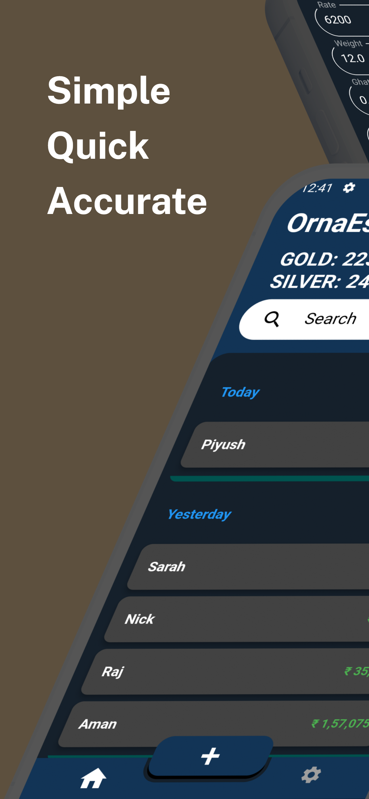
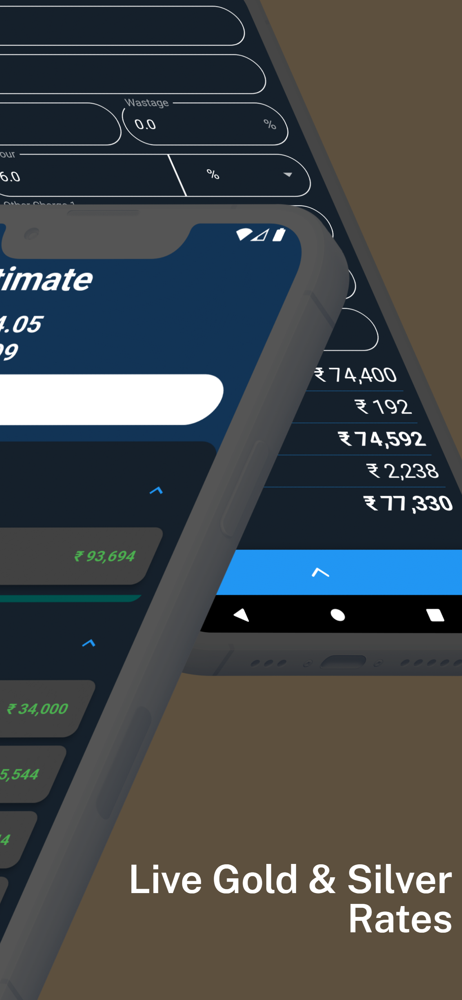
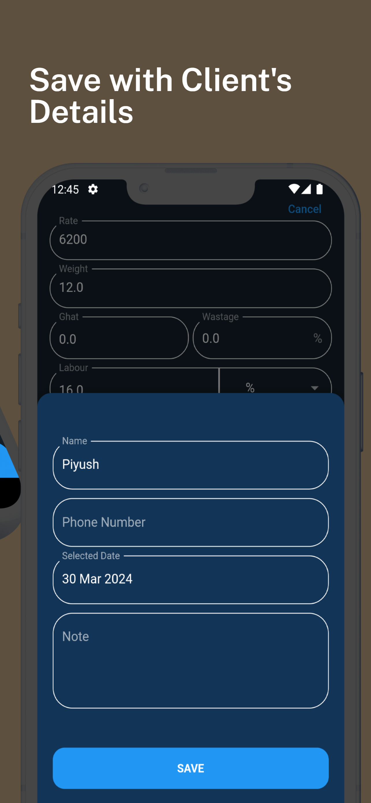
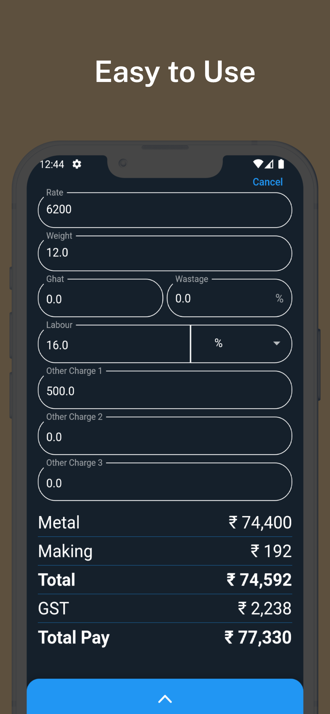
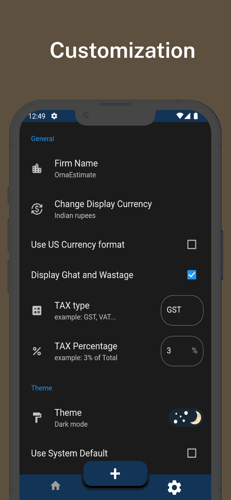

  

# OrnaEstimate 💍📏  
**Your Ultimate Jewellery Price Calculator**

Say goodbye to manual calculations! OrnaEstimate streamlines jewellery pricing with precision and ease — tailored for modern jewelers.

---

## 📲 Download Now

---

## ✨ Key Features

- ⚡ **Effortless Pricing** – Instant and accurate jewellery price calculation
- 📊 **Live Gold & Silver Rates** – Real-time price sync
- 💾 **Save & Edit Estimates** – Manage client quotations with ease
- 🎨 **Customizable Themes** – Light and dark mode support
- 🔧 **Tailored Settings** – Tax, currency, and firm details fully customizable
- 🔁 **Ghat-Wastage Conversion** – Simplify industry-specific unit conversion
- 🛠 **Making Charge Management** – Support per piece or per gram inputs
- ✅ **Inclusive GST Rates** – Auto TAX calculation built-in
- 🤝 **No Training Needed** – Clean and intuitive UI/UX

---

## 🖼 App Screenshots

  
  
  
  
  

---

## 📱 Built With

- **Flutter** – Fast, cross-platform mobile development
- **Dart** – Modern, reactive programming
- **Material Design** – Clean, accessible UI

---

## 📦 Project Highlights

OrnaEstimate was created to simplify the day-to-day operations of jewelers by eliminating the need for repetitive manual calculations. Built with feedback from real-world users, it strikes a balance between flexibility and accuracy.

> Available on the Google Play Store and currently used by jewelers across India.

---

## 📫 Contact

Need help or want to collaborate?

- 📧 Email: [harshpala1@gmail.com](mailto:harshpala1@gmail.com)  
- 📞 Phone: +91 95864 78159  
- 🧑‍💻 Developer: Harsh Pala

---

> Made with 💍 in India.
